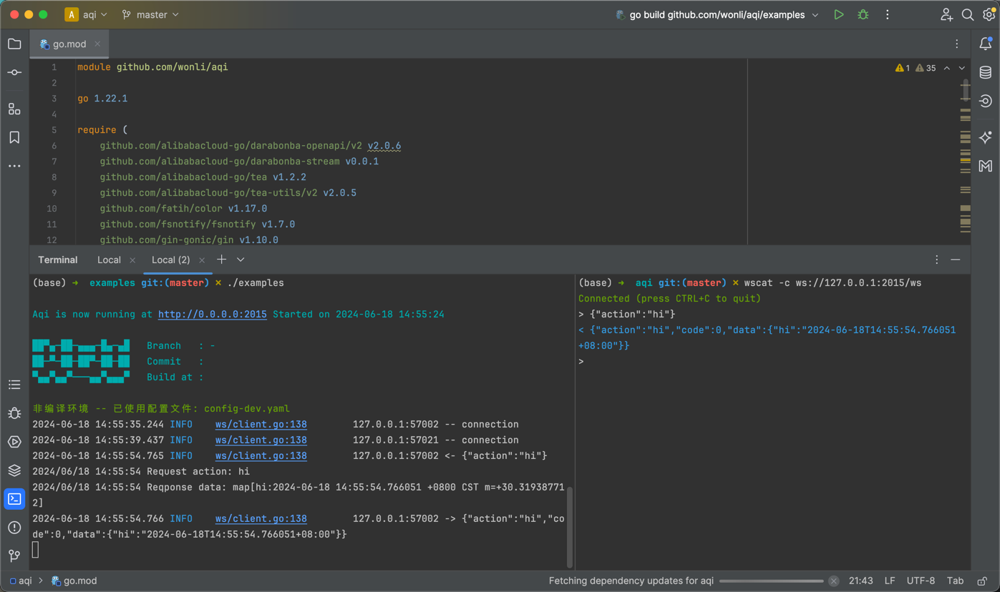

# Aqi

Aqi is a Golang Websocket business framework that supports net/http, gin, chi, etc. It integrates underlying third-party libraries such as viper, gorm, gobwa/ws, gjson, zap, asynq, which facilitates the rapid development of Websocket applications.

### Quick Start

Install the `aqi` CLI and create a project in three steps:

```bash
# 1. Install aqi
go install github.com/wonli/aqi/cmd/aqi@latest

# 2. Generate project
aqi new myapp && cd myapp

# 3. Run
go run . api
```

On first run, `config-dev.yaml` is auto-generated. The API and WebSocket server start on port `2015` (configurable in the config file). Use [wscat](https://github.com/websockets/wscat) to connect to `ws://localhost:2015/ws` and test the built-in `hi` action.

[简体中文](./docs/zh-CN.md)

### Usage

On the first run, a `config-dev.yaml` configuration file will be automatically generated in the working directory. You can configure the application start port, database, and other settings.

After the service starts, use [wscat](https://github.com/websockets/wscat) to establish a websocket connection with the server. Here is a screenshot of the operation.





### Interaction Protocol

Input and output uniformly use `JSON`. Here, `Action` is the name registered in the routing, and `Params` are in JSON string format.

```go

type Context struct {
	...
	Action   string
	Params   string
	...
}
```


Response Format:

```go
type Action struct {
	Action string `json:"action"`

	Code int    `json:"code"`
	Msg  string `json:"msg,omitempty"`
	Data any    `json:"data,omitempty"`
}
```


### Quick Start

In `ahi.Init`, specify the configuration file via `aqi.ConfigFile`, which defaults to `yaml` format. The service name and port are specified in the `yaml` file path through `aqi.HttpServer`. The contents of the entry file are as follows:

```go
package main

import (
	"net/http"
	"time"

	"github.com/wonli/aqi"
	"github.com/wonli/aqi/ws"
)

func main() {
	app := aqi.Init(
		aqi.ConfigFile("config.yaml"),
		aqi.HttpServer("Aqi", "port"),
	)

	// Create router
	mux := http.NewServeMux()
	// WebSocket Handler
	mux.HandleFunc("/ws", func(w http.ResponseWriter, r *http.Request) {
		ws.HttpHandler(w, r)
	})

	// Register router
	wsr := ws.NewRouter()
	wsr.Add("hi", func(a *ws.Context) {
		a.Send(ws.H{
			"hi": time.Now(),
		})
	})

	app.WithHttpServer(mux)

	// 启动应用
	app.Start()
}
```


### With Gin

`aqi` can be very conveniently integrated with other WEB frameworks. You just need to correctly register `handler` and `app.WithHttpServer`. It supports any implementation of `http.Handler`.


```go
package main

import (
	"net/http"
	"time"

	"github.com/gin-gonic/gin"

	"github.com/wonli/aqi"
	"github.com/wonli/aqi/ws"
)

func main() {
	app := aqi.Init(
		aqi.ConfigFile("config.yaml"),
		aqi.HttpServer("Aqi", "port"),
	)

	engine := gin.Default()
	// Handler
	engine.GET("/ws", func(c *gin.Context) {
		ws.HttpHandler(c.Writer, c.Request)
	})

	// Router
	wsr := ws.NewRouter()
	wsr.Add("hi", func(a *ws.Context) {
		a.Send(ws.H{
			"hi": time.Now(),
		})
	})

	app.WithHttpServer(engine)
	app.Start()
}
```


### Middlewares

First, define a simple logging middleware that prints the received `action` before processing the request and prints the response content after processing.

```go
func logMiddleware() func(a *ws.Context) {
	return func(a *ws.Context) {
		log.Printf("Request action: %s ", a.Action)
		a.Next()
		log.Printf("Reqponse data: %s ", a.Response.Data)
	}
}
```

Register the middleware to the router using the `Use` method.

```go
// 注册WebSocket路由
wsr := ws.NewRouter()
wsr.Use(logMiddleware()).Add("hi", func(a *ws.Context) {
    a.Send(ws.H{
        "hi": time.Now(),
    })
})
```

You can also use the form of router groups.

```go
// Router
wsr := ws.NewRouter()
r1 := wsr.Use(logMiddleware())
{
    r1.Add("hi", func(a *ws.Context) {
        a.Send(ws.H{
            "hi": time.Now(),
        })
    })

    r1.Add("say", func(a *ws.Context) {
        a.Send(ws.H{
            "say": "hi",
        })
    })
}
```

This way, the console will print logs before and after each request.


### Production Mode

Compiling `Aqi` directly will run in `dev` mode. To run in production mode, pass the following parameters during compilation. For more details, please refer to the `examples/Makefile` file.


```shell
LDFLAGS = "-X '$(FLAGS_PKG).BuildDate=$(BUILD_DATE)' \
		   -X '$(FLAGS_PKG).Branch=$(GIT_BRANCH)' \
		   -X '$(FLAGS_PKG).CommitVersion=$(GIT_COMMIT)' \
		   -X '$(FLAGS_PKG).Revision=$(GIT_REVISION)' \
		   -extldflags '-static -s -w'"
```

### API Documentation

Generate API docs from your router files with `aqi docgen init`:

```bash
# In project root (e.g. myapp/)
aqi docgen init
```

This creates a `docs/` directory with:
- `doc-config.yaml` – doc config and categories
- `api_viewer.html` – web viewer for API docs
- `docgen.go` – embeddable doc server
- `cmd_api_*.json` – parsed action docs from `internal/router`

Options: `-r` router dir (default `./internal/router`), `-f` format (`json` or `markdown`), `-p` package name.


