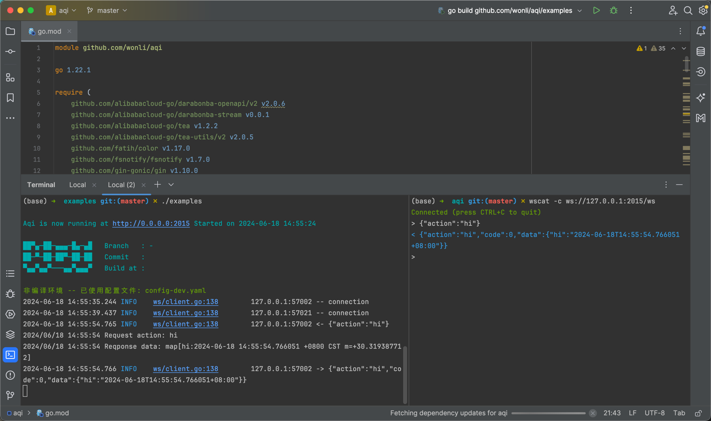

# Aqi

Aqi是一个Golang Websocket业务框架，支持`net/http`, `gin`, `chi`等，底层整合了`viper`, `gorm`, `gobwa/ws`, `gjson`, `zap`, `asynq`等优秀第三方库，方便快速展开Websocket业务

### 快速开始

三步安装 `aqi` CLI 并创建项目：

```bash
# 1. 安装 aqi
go install github.com/wonli/aqi/cmd/aqi@latest

# 2. 生成项目
aqi new myapp && cd myapp

# 3. 运行
go run . api
```

首次运行会自动生成 `config-dev.yaml` 配置文件。API 和 WebSocket 服务默认监听端口 `2015`（可在配置文件中修改）。使用 [wscat](https://github.com/websockets/wscat) 连接 `ws://localhost:2015/ws` 可测试内置的 `hi` 动作。

### 使用

第一次运行时会在工作目录下自动生成`config-dev.yaml`配置文件，你可以配置程序启动端口、数据库等信息。


服务启动后使用  [wscat](https://github.com/websockets/wscat) 与服务器建立websocket链接，运行截图如下。





### 交互协议

输入输出统一使用`JSON`，其中 `Action`为路由中注册的名字， `Params`为JSON格式字符串

```go

type Context struct {
	...
	Action   string
	Params   string
	...
}
```


响应内容格式:

```go
type Action struct {
	Action string `json:"action"`

	Code int    `json:"code"`
	Msg  string `json:"msg,omitempty"`
	Data any    `json:"data,omitempty"`
}
```


### 快速开始

在`ahi.Init`中通过`aqi.ConfigFile`指定配置文件，默认使用`yaml`格式，通过`aqi.HttpServer`指定服务名称和端口在`yaml`文件中的路径, 入口文件内容如下：

```go
package main

import (
	"net/http"
	"time"

	"github.com/wonli/aqi"
	"github.com/wonli/aqi/ws"
)

func main() {
	app := aqi.Init(
		aqi.ConfigFile("config.yaml"),
		aqi.HttpServer("Aqi", "port"),
	)

	// 创建路由
	mux := http.NewServeMux()
	// WebSocket Handler
	mux.HandleFunc("/ws", func(w http.ResponseWriter, r *http.Request) {
		ws.HttpHandler(w, r)
	})

	// 注册路由
	wsr := ws.NewRouter()
	wsr.Add("hi", func(a *ws.Context) {
		a.Send(ws.H{
			"hi": time.Now(),
		})
	})

	app.WithHttpServer(mux)

	// 启动应用
	app.Start()
}
```


### 与Gin整合

`aqi`能非常方便的与其他WEB框架整合，只需要正确注册`handler`和`app.WithHttpServer`，只要实现了 `http.Handler`都支持。


```go
package main

import (
	"net/http"
	"time"

	"github.com/gin-gonic/gin"

	"github.com/wonli/aqi"
	"github.com/wonli/aqi/ws"
)

func main() {
	app := aqi.Init(
		aqi.ConfigFile("config.yaml"),
		aqi.HttpServer("Aqi", "port"),
	)

	engine := gin.Default()
	// 注册handler
	engine.GET("/ws", func(c *gin.Context) {
		ws.HttpHandler(c.Writer, c.Request)
	})

	// 注册路由
	wsr := ws.NewRouter()
	wsr.Add("hi", func(a *ws.Context) {
		a.Send(ws.H{
			"hi": time.Now(),
		})
	})

	app.WithHttpServer(engine)
	app.Start()
}
```


### 中间件

先定义一个简单的日志中间件，在处理请求前先打印当前接收到的`action`，在处理完成后打印响应内容。

```go
func logMiddleware() func(a *ws.Context) {
	return func(a *ws.Context) {
		log.Printf("Request action: %s ", a.Action)
		a.Next()
		log.Printf("Reqponse data: %s ", a.Response.Data)
	}
}
```

使用`Use`方法将中间件注册到路由中

```go
// 注册WebSocket路由
wsr := ws.NewRouter()
wsr.Use(logMiddleware()).Add("hi", func(a *ws.Context) {
    a.Send(ws.H{
        "hi": time.Now(),
    })
})
```

当然也可以用路由组的形式

```go
// 注册WebSocket路由
wsr := ws.NewRouter()
r1 := wsr.Use(logMiddleware())
{
    r1.Add("hi", func(a *ws.Context) {
        a.Send(ws.H{
            "hi": time.Now(),
        })
    })

    r1.Add("say", func(a *ws.Context) {
        a.Send(ws.H{
            "say": "hi",
        })
    })
}
```

这样控制台在每个请求前后都会打印日志


### 生产模式

直接编译`Aqi`会以`dev`模式运行，以生产模式运行请在编译时传入以下参数，详细内容请查看`examples/Makefile`文件


```shell
LDFLAGS = "-X '$(FLAGS_PKG).BuildDate=$(BUILD_DATE)' \
		   -X '$(FLAGS_PKG).Branch=$(GIT_BRANCH)' \
		   -X '$(FLAGS_PKG).CommitVersion=$(GIT_COMMIT)' \
		   -X '$(FLAGS_PKG).Revision=$(GIT_REVISION)' \
		   -extldflags '-static -s -w'"
```

### API 文档生成

使用 `aqi docgen init` 从路由文件生成 API 文档：

```bash
# 在项目根目录下（如 myapp/）
aqi docgen init
```

会在 `docs/` 目录生成：
- `doc-config.yaml` – 文档配置与分类
- `api_viewer.html` – API 文档网页查看器
- `docgen.go` – 可嵌入的文档服务
- `cmd_api_*.json` – 从 `internal/router` 解析的 action 文档

可选参数：`-r` 路由目录（默认 `./internal/router`）、`-f` 输出格式（`json` 或 `markdown`）、`-p` 包名。


